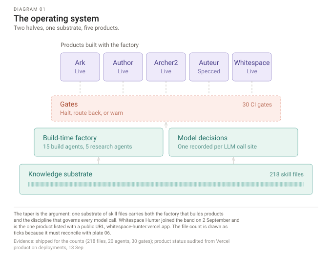

# ai-systems

<!-- On the first push, replace OWNER and uncomment. A badge is worth having; a red
     or broken one is worse than none, which is why it is not live yet.
[](https://github.com/OWNER/ai-systems/actions/workflows/diagrams.yml)
-->

The published architecture of an AI operating system: a multi-agent factory that compiles
products, and the runtime engine that serves them. Twenty agents dispatched in parallel
into isolated git worktrees, gated at every handoff by typed contracts and a four-path
verification stack, over one corpus of skill files. The factory and the product
repositories are private. This is the methods section — the architecture, the standards,
and the parts that can be checked.

```
git clone … && cd ai-systems && npm run diagrams && npm run diagrams:verify
```

No API key, no account, no network. The plates below are compiled from
`tools/diagram-compiler/`, and `diagrams:verify` regenerates them, fails if the committed
artwork differs from what the source produces, checks that every count on a plate matches
`docs/evidence.md`, and measures the text geometry in a real browser. The artwork is held
to the same discipline as the contracts it describes.

---



*The taper is the argument: one substrate carries a build side and a run side, and the
compression from the corpus to the products is a shape rather than an assertion.*

## The ten plates

Each proves one claim. Where two would prove the same thing, one of them is wrong — so
this is not ten views of the architecture, it is ten separate arguments about it.
`docs/architecture.md` carries all ten in prose, for anything that does not render images.

| # | Plate | Claim | Evidence |
|---|---|---|---|
| 01 | [Operating system](docs/diagrams/01-operating-system.svg) | A system with a build side and a run side, not a folder of scripts | audited · contested counts |
| 02 | [Knowledge substrate](docs/diagrams/02-knowledge-substrate.svg) | Importance in the corpus is computed, not declared | shipped gate · contested counts |
| 03 | [Compiler spine](docs/diagrams/03-compiler-spine.svg) | Orchestration with isolation, not a prompt chain | shipped |
| 04 | [Contract spine](docs/diagrams/04-contract-spine.svg) | One source of truth, and the cost of changing it is computed | shipped |
| 05 | [Verification stack](docs/diagrams/05-verification-stack.svg) | Four paths, and the evidence is frozen before any is chosen | shipped |
| 06 | [Context residency](docs/diagrams/06-context-residency.svg) | Budgeting is a measurement, and so is uptake | shipped · audited figure |
| 07 | [Hardening loop](docs/diagrams/07-hardening-loop.svg) | Promotion requires a proof of convergence | shipped |
| 08 | [Learning loops](docs/diagrams/08-learning-loops.svg) | Two loops: one a person gates, one that earns its own entries | shipped |
| 09 | [Runtime engine](docs/diagrams/09-runtime-engine.svg) | Production operation with cost governance | shipped |
| 10 | [Two-lane execution](docs/diagrams/10-two-lane-execution.svg) | The constraint is scoped, not total | audited |

The consolidated reference set, with each plate's full reading and what changed in the
September revision, is at [`docs/ai-operating-system.pdf`](docs/ai-operating-system.pdf).

## Products

Built on the factory. The repositories are private; a 404 is worse than no link.

| Product | What it is | Status |
|---|---|---|
| Whitespace Hunter | Market category discovery from search-demand signals | Live — [whitespace-hunter.vercel.app](https://whitespace-hunter.vercel.app) |
| Ark | Brand intelligence, chat-first | Live |
| Author | Brand identity system with an SVG production pipeline | Live |
| Archer2 | Persona analysis platform | Dormant |
| Auteur | AI creative production | Specced |

Product status other than Whitespace Hunter is `unverified` — no source document
corroborates it, and `docs/evidence.md` says so rather than letting the table imply
otherwise.

## What this rests on

Three tiers, and nothing is tiered higher than its weakest input. **Shipped** means a
named file implements it, and the right response is to ask to see the file. **Audited**
means observed during a repository read and not re-counted from code. **Contested** means
two sources disagree and the conflict is open rather than averaged away.

Four counts are currently contested: the skill-file total, the layer count, the gate
count, and whether nineteen hand-authored contracts derive the reported forty-three
generated schemas. [`docs/evidence.md`](docs/evidence.md) has every figure, its tier, its
source, and the date it landed — and it is also the file the diagram compiler reads its
expected counts from, so a figure corrected there fails the plate that draws it until the
plate is redrawn, and vice versa. Neither can be edited alone.

One defect is published deliberately. `agent-00.config.ts` cited a section anchor that did
not resolve, so the spec validator — first in the pipeline, the gate every build passes
through — was handed the literal string `[section not found]` where its constitution
should have been. A citation that silently resolves to an error string is worse than one
that throws, because the pipeline keeps running and everything downstream is confidently
built on nothing. Found by audit rather than by symptom, fixed 12 September, and the
Level-0 gate on plate 02 now catches the class.

## Not here yet

Six runnable demonstrations — contract derivation and blast radius, semantic drift without
a model, route-back classification, given-against-done receipts, worktree isolation, and
an evidence-commitment tamper. They are extracted from the private factory rather than
reimplemented here, because fresh code that merely resembles the original is a facsimile
and one probing question exposes the gap.

Until they land, this repository states its claims and lets you check the artwork against
its source. It does not yet let you check the system. That distinction is the whole point
of the tier column above, so it would be strange to blur it here.
