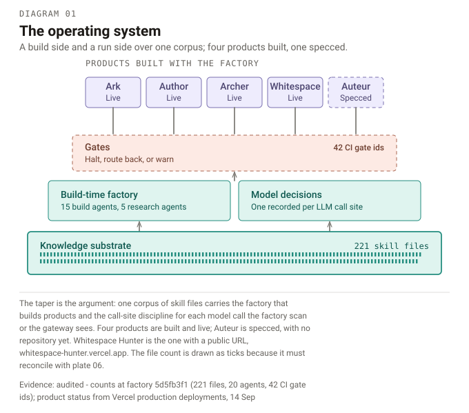
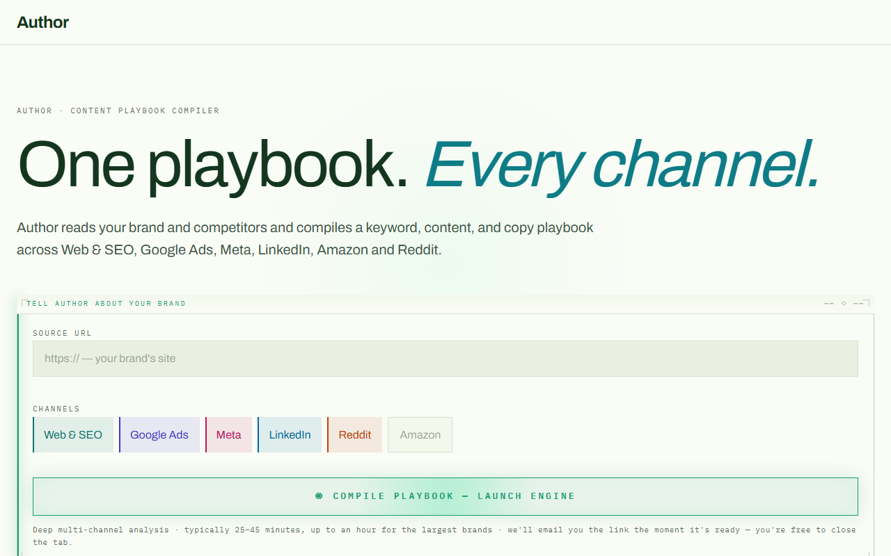
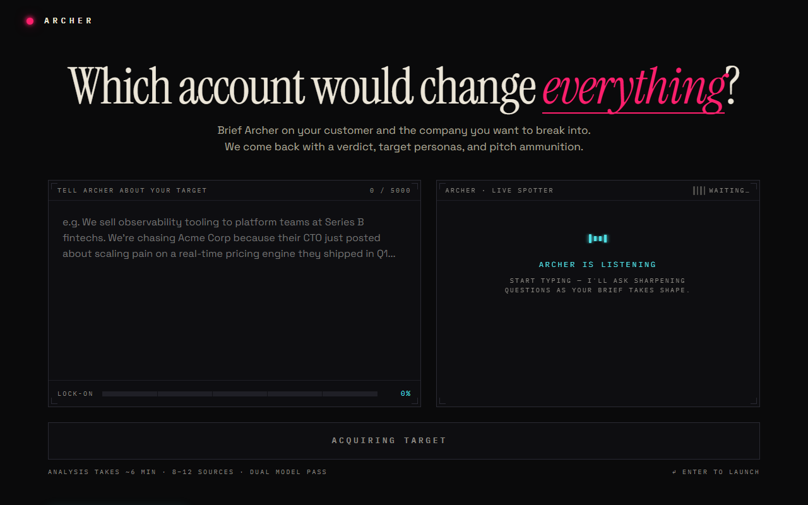

# ai-systems

[](https://github.com/Naviin19/ai-systems/actions/workflows/diagrams.yml)
[](https://github.com/Naviin19/ai-systems/actions/workflows/demos.yml)

**Making probabilistic systems observable, testable and governable.**

A language model can return a correct answer and an incorrect one through the same interface, in
the same shape, at the same apparent confidence. This repository is the published architecture of
a system that surrounds that component with deterministic contracts, verification, provenance,
recovery and governance: a compiler that turns specifications, knowledge, contracts and policies
into coordinated agent execution, with every mechanism shown, measured and demonstrated.

Three names recur. **The factory** is the private repository, `skill-ecosystem`, that builds
software with agents. **The products** — three live, and a fourth in development — were built with
it. This repository,
`ai-systems`, is the factory's published architecture: what was built, the evidence behind every
figure, and demos that run its code.

The unit of reliability engineering here is not the fix. It is defect → understanding → invariant →
automated enforcement, and every check in this repository was seen failing on a planted defect before
its pass was trusted.

Twenty agent configurations are dispatched in dependency waves, each into its own git worktree. Every
handoff between them is parsed against a typed contract and passed through a verification stack.
Behind all of it sits one corpus of 221 skill files, the factory's engineering documents. No agent
carries it. Each carries an
index of what exists, and fetches what the work turns out to need.

```
git clone https://github.com/Naviin19/ai-systems && cd ai-systems
npm ci && npm run demo
```

Twelve offline demos need no API key, no account and no network, and CI runs them on Linux, macOS and
Windows with every outbound connection refused. One opt-in live demo does need a key, runs on your own
machine against your own account, and lives in [`demos/live/`](demos/live/) — `npm run demo` never
reaches it.

---

## The proposal, in five documents

| Document | The question it answers |
|---|---|
| [**Engineering Probabilistic Systems**](docs/ENGINEERING.md) | What was built, and why does each mechanism have to exist? Thirteen mechanisms on one dependency spine — the engineering sequence, a different cut from the thirteen plates — each stage answering a question the one before it cannot — from knowledge and specification through contracts, orchestration and abstention to verification, runtime, learning and the product surface. |
| [**The Systems Thesis**](docs/THE-SYSTEMS-THESIS.md) | What do I hold to be true about building these systems, and how strong is the evidence for each claim? |
| [**Executable Expertise**](docs/EXECUTABLE-EXPERTISE.md) | Can domain expertise be compiled into a system, or only described to one? |
| [**Brand as an API**](docs/BRAND-AS-AN-API.md) | What does that look like in one domain? A brand book produced by one product and consumed as a typed object by two others, over a graph of the marketing canon. |
| [**Hypotheses**](docs/HYPOTHESES.md) | What is still unknown, and what would settle it? |

If you read one, read the first.

---



## The thirteen plates

Each plate shows one behaviour of the factory in operation.
[`docs/architecture.md`](docs/architecture.md) carries all thirteen in prose, for anything that does not
render images.

| # | Plate | What it shows | Evidence |
|---|---|---|---|
| 01 | [Operating system](docs/diagrams/01-operating-system.svg) | A system with a build side and a run side, not a folder of scripts | audited counts |
| 02 | [Knowledge substrate](docs/diagrams/02-knowledge-substrate.svg) | Importance in the corpus is measured, and the measurement is checked | shipped checks · audited counts |
| 03 | [Compiler spine](docs/diagrams/03-compiler-spine.svg) | Orchestration with isolation, not a prompt chain | shipped · audited waves |
| 04 | [Contract spine](docs/diagrams/04-contract-spine.svg) | One source of truth, and the reach of changing it is computed | shipped · audited counts |
| 05 | [Verification stack](docs/diagrams/05-verification-stack.svg) | Four outcomes, and a failure that retrying can fix is told apart from one it cannot | shipped |
| 06 | [Context residency](docs/diagrams/06-context-residency.svg) | Budgeting is a measurement, and so is uptake | shipped · audited reduction |
| 07 | [Hardening loop](docs/diagrams/07-hardening-loop.svg) | Promotion requires a proof of convergence | shipped |
| 08 | [Learning loops](docs/diagrams/08-learning-loops.svg) | Two loops, and in both a person decides what becomes permanent | shipped · audited protocol |
| 09 | [Runtime engine](docs/diagrams/09-runtime-engine.svg) | The packages a shipped product runs on, and the product that runs on them | shipped · audited caller |
| 10 | [Two-lane execution](docs/diagrams/10-two-lane-execution.svg) | The constraint is scoped, not total | shipped |
| 11 | [Prompts as specifications](docs/diagrams/11-prompts-as-specifications.svg) | A prompt is an artifact with a declared shape, graded before it is used | shipped · audited floors |
| 12 | [Writable surface](docs/diagrams/12-writable-surface.svg) | Every place a note can land is on a row, and a detector holds the rows to the tree | shipped · advisory gate · audited counts |
| 13 | [Gate ladder](docs/diagrams/13-gate-ladder.svg) | Enforcement is a ladder, not a wall: block, advisory with a written condition, off | shipped · audited counts |

The reference set, with every plate, its reading and the evidence behind each figure, is
[`docs/ai-operating-system.pdf`](docs/ai-operating-system.pdf). With Python and
`pip install -r tools/diagram-compiler/requirements.txt`, `npm run diagrams && npm run
diagrams:verify` regenerates the plates, checks every count on them against
[`docs/evidence.md`](docs/evidence.md), and measures their text in a real browser.

## Demos

Twelve offline demos and one live demo run code extracted from the factory and the products built
with it.

| Demo | Plate | Proves |
|---|---|---|
| [contract](demos/01-contract/) | 04 | A producer's type change that breaks a consumer is named, with the playbook line that reads the field, before any agent runs |
| [drift](demos/02-drift/) | 05 | A handoff is compared with the agent's own earlier builds by a deterministic embedder, and only drift at the enforcing level stops a run |
| [routeback](demos/03-routeback/) | 05 | The verification stack stops real defects and leaves benign changes alone, at a measured rate held to a published bar |
| [receipts](demos/04-receipts/) | 06 | A dispatch leaves a receipt of what the agent was given, loaded and cited, and the receipt claims no more than that proves |
| [isolation](demos/05-isolation/) | 03 | Agents run together where the graph allows, each in its own worktree, and their merges reach main because they are serialised |
| [attest](demos/06-attest/) | 05 | The evidence behind an agent's claims is hash-locked when it emits, before any gate or judge reads it |
| [powerbar](demos/07-powerbar/) | — | Input quality is scored as the user types, and the interface does not depend on a model being reachable |
| [silence](demos/08-silence/) | 05 | A detector must catch a defect it planted itself before it may report a corpus clean |
| [abstain](demos/09-abstain/) | — | A signal with nothing to score on returns null rather than zero, and the composite renormalises over what reported |
| [reported-paths](demos/10-reported-paths/) | — | Every path a handoff names is resolved against disk; a URL route is never a missing file, and zero handoffs is unevaluated, not clean |
| [write-surface](demos/11-write-surface/) | 12 | A file that writes to disk and sits on no row, and a free-text key the envelope does not declare, are found before the tree is called clean |
| [emitter-instructions](demos/12-emitter-instructions/) | — | An instruction an agent cannot perform is classed by the route it lacks, and a comment or a prose bullet is left alone |
| [enrich](demos/live/enrich/) · live | — | Forced tool choice returns schema-valid structure from a real model, and five concurrent identical calls make one dispatch; reads your own key, at most three calls, and `npm run demo` never reaches it |

## Products

Built with the factory, and the reason any of the above is worth reading. The repositories are
private; a link below opens the running product.

| Product | What it does |
|---|---|
| [Ark](https://ark-now.vercel.app) | Researches and writes a brand book from a URL |
| [Author](https://author-now.vercel.app) | Compiles a multi-channel content playbook from that brand book, read as a typed object rather than as prose |
| [Archer](https://archer2.vercel.app) | B2B sales intelligence: a verdict, target personas and pitch material for one account |
| Whitespace Hunter | Scores how much runway an emerging category has left, from search and SERP signals — in development |

Each live product, as its public URL served it on 27 September 2026. The repositories stay private;
the products do not.

| [](https://ark-now.vercel.app) | [](https://author-now.vercel.app) |
|---|---|
| [](https://archer2.vercel.app) | |

## What this rests on

Every figure carries an evidence tier — **shipped** means a named file implements it, **audited**
means counted at a named commit or on a named date — and nothing is tiered higher than its weakest
input. Every figure is checked against the factory's code at a named commit by a script that
resolves each citation to the lines that show it; counts and citations each carry their own
date, and a manifest lists how every count is derived.
[`docs/evidence.md`](docs/evidence.md) records how every figure was measured, and the diagram
compiler checks the artwork against it, so a figure and the plate that draws it cannot be edited
apart.

## License

[MIT](LICENSE).
